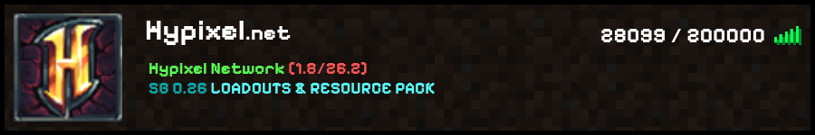
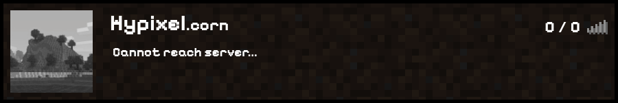

# minecraftstatusfrontend
A simple frontend implementing mcsrvstat api.
It fetches all the important data of a given server inside the script and then serves it in a pretty and simple way.

What it shows:
 - Full server ip
 - Server icon
 - MOTD
 - Player count
 - 2 different states of connection bars for online/offline servers

#

#

#
